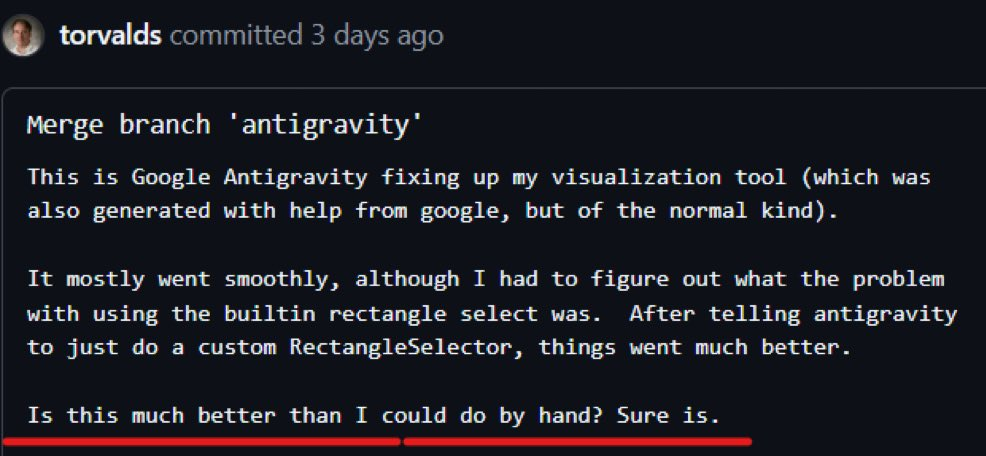

+++
title = 'Inference'
date = '2026-02-02T09:40:44-08:00'
draft = false
+++

It’s February 2, and we are living in what Andrej Karpathy has coined *Software 2.0*.

Linus Torvalds has spoken positively about “vibe coding.”

Tools like Claude Code have become default companions for many solopreneurs building and shipping products.

This is a fundamental change in how software is produced.

Developers are now burning thousands of dollars’ worth of tokens to vibe code the next billion-dollar app. As a result, token usage and compute cost have become hot topics of debate across the developer community.

But it’s not clear that any of these numbers reflect what is actually happening under the hood.

To answer these questions, we need to look at inference.

---

## What Is Inference?

When you send a prompt to a language model, you are not “querying a database” or “looking up an answer.” You are triggering a forward pass through a very large neural network.

This process is called inference.

Inference is the stage where a trained model takes input tokens and produces output tokens. It is where GPUs spend most of their time and where most of the real cost of AI systems lives.

At a high level, inference has two parts:

- **Prefill**: processing the entire prompt and building internal state  
- **Generation**: producing new tokens one by one

Naively, both of these steps are expensive. Large prompts require large amounts of attention computation. Long conversations require repeatedly processing growing contexts.

Without optimization, serving modern language models at scale would be prohibitively slow and expensive.

This is where inference engines come in.

---

## Inference at Scale and vLLM

In practice, production AI systems do not run models directly through raw deep learning frameworks. They use specialized inference engines that are designed to maximize throughput and minimize wasted computation.

One of the most widely used open-source engines is vLLM.

vLLM is not a model. It is a high-performance runtime for serving language models. Its purpose is to make inference efficient by:

- reusing cached computation  
- batching requests dynamically  
- managing GPU memory intelligently  
- minimizing redundant work

Most importantly for this discussion, vLLM implements aggressive prefix and KV caching. When multiple requests share the same prompt prefix, vLLM can reuse previously computed attention states instead of recomputing them from scratch.

In other words, if two prompts look mostly the same, the second one is much cheaper than the first.

This behavior mirrors how large commercial providers run their systems internally. vLLM makes these optimizations visible and measurable, which makes it a useful tool for understanding real-world inference economics.

In the sections that follow, I’ll use vLLM to measure how much “token usage” actually turns into GPU work, and how much is silently absorbed by caching.

---

## Methodology (Coming Soon)

In this section, I’ll outline the experimental setup used to measure prefix cache hits, logical token usage, and effective compute cost using vLLM on Apple Silicon.

This includes:

- Model selection  
- Prompt construction  
- Cache-friendly vs cache-hostile workloads  
- Metrics collection  
- Visualization pipeline

---

## Results (What vLLM’s Docs and Metrics Already Tell Us)

Even before running custom benchmarks, vLLM’s documentation makes the core point clear: “token usage” is not the same thing as “compute performed.”

### Automatic Prefix Caching: Skipping Redundant Prefill

vLLM implements **prefix caching** (also called Automatic Prefix Caching / APC): it caches the KV (key/value) cache for previously processed requests and reuses it when a new request shares the same prefix, allowing the engine to skip computing the shared portion of the prompt. :contentReference[oaicite:0]{index=0}

This is especially relevant for coding and agentic workflows, where prompts often look like:

- a large, repeated system prompt + repo context (stable prefix)
- a small changing instruction (tiny suffix)

In that shape of workload, the *logical* number of prompt tokens can stay high, while the *actual prefill compute* drops dramatically after the first request, because the expensive prefix work is reused. :contentReference[oaicite:1]{index=1}

### The Metrics Make Cache Hits Measurable

When serving via the OpenAI-compatible API server, vLLM exposes Prometheus metrics at the `/metrics` endpoint. :contentReference[oaicite:2]{index=2}

The key counters for this post are:

- `vllm:prefix_cache_queries` — queried tokens
- `vllm:prefix_cache_hits` — tokens found in cache
- `vllm:prompt_tokens` — prefill tokens processed
- `vllm:generation_tokens` — generation tokens processed :contentReference[oaicite:3]{index=3}

These let us compute a simple, concrete signal:

> **Prefix cache hit rate ≈ prefix_cache_hits / prefix_cache_queries** :contentReference[oaicite:4]{index=4}

Even without a GPU profiler, these counters reveal whether repeated prompts are being served through reuse vs fresh compute.

### What We Should Expect to Observe

Given how vLLM’s prefix caching is designed (cache KV blocks for processed prefixes; reuse them for subsequent matching prefixes), we should expect two distinct regimes. :contentReference[oaicite:5]{index=5}

**Cache-friendly workload (shared prefix):**
- `vllm:prefix_cache_hits` grows rapidly as the same context repeats
- prefill work for repeated prefixes is skipped via reuse
- time-to-first-token (TTFT) generally improves as more requests become cache hits :contentReference[oaicite:6]{index=6}

**Cache-hostile workload (randomized prefixes):**
- `vllm:prefix_cache_hits` stays low relative to queries
- more work is done as fresh prefill compute
- TTFT remains consistently higher :contentReference[oaicite:7]{index=7}

### Why This Matters for “Token Cost”

Token dashboards count **logical tokens** (prompt + output length). Prefix caching changes the economics because a large fraction of prompt processing can be reused when prefixes repeat.

So the same “10,000-token prompt” can be *expensive once* and *cheap many times*—and vLLM’s metrics make that gap visible. :contentReference[oaicite:8]{index=8}

---
